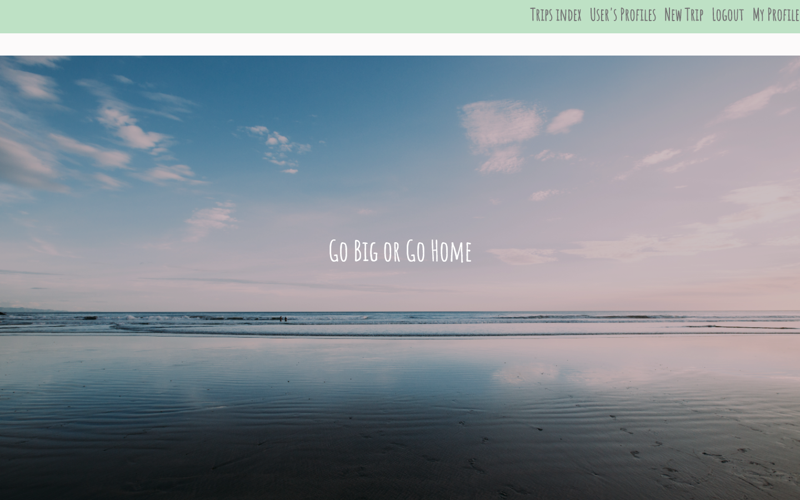
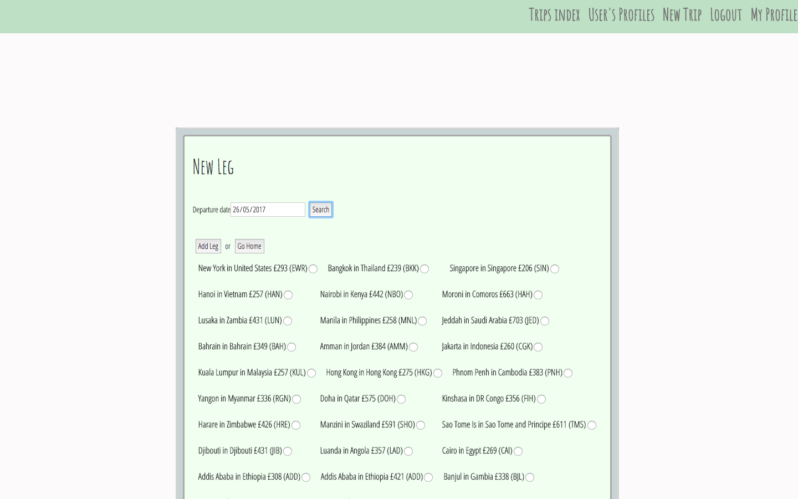
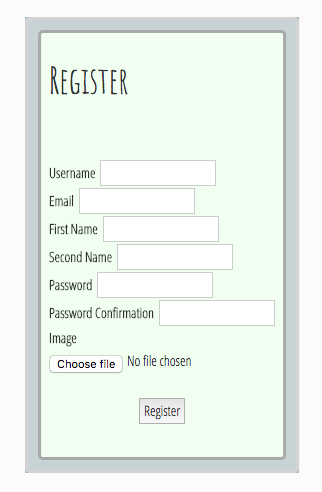

# Go Big or Go home APP


<p align="center" style="padding: 20px 0;">
  
</p>

Full app can be seen here at https://sleepy-tor-76650.herokuapp.com/

Github repository for the backend API can be viewed [here](https://github.com/hannahwynnjones/project-4-api-backend)

**[Gallery](#Gallery)**  


#### Approach/ how it works

As an avid traveller, I know how frustrating it is trying to design a trip around the world that keeps within a budget and satisfies everyone of your friends.  My app makes it really easy for a group of friends to join together and figure that out.  Users can login and create a trip leaving from a UK airport.  Once created, the user can add 'legs' to the trip which grabs live prices from Skyscanner's API.  I then used this data with the Google Maps API to create a route on the map.  Users can then choose to either add further 'legs' ('go big') or 'go home' (back to the initial airport).  From there, other users can comment on the trip giving feedback and choose to 'attend' if they like the trip too.

#### The Build

Firstly I set up API using Ruby on Rails. I created the database, scaffolded the User, Trip, Airport and Comment models and created two join tables; one for the user-trip and another for the airport-trip.  I then added serializers and relationships to these models.  

I then added validations to the user model so that the username must always be present and the email is unique. I added Seeds for users, airports and 2 trips.  

In the front-end, I fleshed out the basic CRUD pages in the views and added their controllers: new, show, index, edit pages, login pages register pages etc.

Once users could create a basic trip, I added the Skyscanner api controller which makes a request to Skyscanner with the date and the original airport.  Skyscanner then sends back the available flights from that airport, the prices and airlines.

I then added image uploaded so that user's could have a profile image and so that trips could also have an image (this wasn't essential but made the app more appealing).

Lastly, I styled the app and implemented the Google maps api so the trip could be viewed on the maps with lines to each airport showing the route.

#### Installation and deployment instructions

This app already has a `bower.json` file with `angular` as a dependency. To install run:

```sh
$ bower install && npm install
```
Deploying to Heroku:

I deployed the Rails API and front-end app separately to Heroku.  

I then added the front-end link to the backend Cors file (in config). and then added Herkou config varibales:

```sh
$ heroku config:add NODE_ENV=production
$ heroku config:add NPM_CONFIG_PRODUCTION=false
```

In the front-end, I added config variables:

```sh
$ heroku config:add API_URL=https://fierce-springs-47268.herokuapp.com
```

And then I ran:
`$ heroku run rails db:migrate db:seed`

#### Unsolved problems

I choose to seed all my airports so that I could add images and would make it less complicated with Skyscanners API and Google Maps API.  However, despite seeding hundreds of airports, I kept finding that it was very easy to choose an airport that wasn't seeded, even though the airports I'd seeded were Skyscanner's 'most popular'.  In hindsight, I'd sacrifice the images and use a combination of APIs to track the trip.

# Gallery

<h5>Welcome page</h5>
<br>
<p align="center">
  
</p>

<h5>Choosing flights with live data from Skycanner</h5>
<br>
<p align="center" style="padding: 20px 0;">
  
</p>

<h5>Profile page where users can see the trips that they are 'attending'</h5>
<br>
<p align="center" style="padding: 20px 0;">
  
</p>

<h5>Register page</h5>
<br>
<p align="center" style="padding: 20px 0;">
  
</p>
